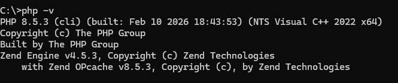
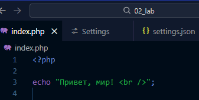
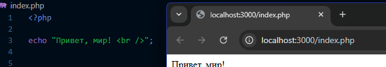
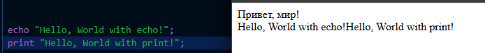
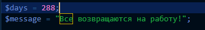
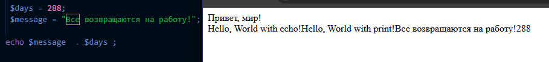
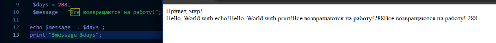
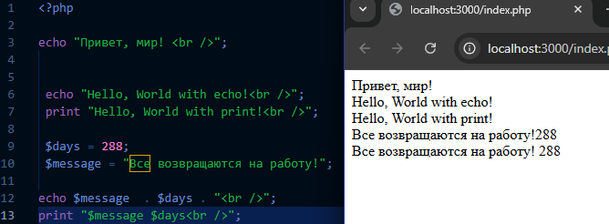

# Лабораторная работа №2. Установка и первая программа на PHP

## Цель работы 

**Целью данной лабораторной работы является установка и настройка среды разработки для работы с языком программирования PHP, а также создание первой программы на PHP.**

### Шаг 1: Установка PHP
1. Перейти на официальный сайт PHP: https://www.php.net/downloads.
2. Загрузить актуальную версию PHP.
3. Распаковать архив в: `D:\загрузки\php-8.5.3-nts-Win32-vs17-x64`.
4. Добавить путь к PHP в переменные среды (`Path`):
    * Откройте Параметры системы `(Win + R → sysdm.cpl)`.
    * Перейдите в `Дополнительно` → `Переменные среды`.
    * В разделе Системные переменные выберите `Path` и добавьте путь `D:\загрузки\php-8.5.3-nts-Win32-vs17-x64`.
    * Сохраните изменения.
5. Проверьте установку, выполнив в командной строке: `php -v`.
   
   
### Шаг 2: Альтернативный способ установки PHP

### Шаг 3. Написание первой PHP-программы

1. Создайте директорию для проекта: `D:\загрузки\php-8.5.3-nts-Win32-vs17-x64\PHP Lab\02_lab`.
2. Создайте файл `index.php` и откройте его в текстовом редакторе.
3. Вставьте следующий код:

   ```php
   <?php

   echo "Привет, мир!";
   ```
   

4. Запустите программу с помощью встроенного веб-сервера PHP . 

### Шаг 4. Вывод данных в PHP

1. Выведите строку "Hello, World!" используя функцию `echo` и `print`.

   ```php
   echo "Hello, World with echo!";
   print "Hello, World with print!";
   ```
   

### Шаг 5. Работа с переменными и выводом

1. Создайте две переменные:
   - Целочисленную переменную `$days` со значением `288`.
   - Строковую переменную `$message` с текстом: `Все возвращаются на работу!`.
     
2. Выведите значения переменных на экран несколькими способами:
   - С использованием конкатенации. *Конкатенация* - это объединение строк, в PHP используется оператор `.`: 
   - С использованием двойных кавычек.
3. Используйте переход на новую строку в выводе используя тэг `<br />`.

## Контрольные вопросы

1. Какие способы установки PHP существуют?
   - Через официальный сайт PHP: https://www.php.net/downloads и настройка в системе переменных окружения PATH
   - Через серверные сборки: XAMPP, WAMP, MAMP
2. Как проверить, что PHP установлен и работает?
   - Через терминал: `php -v`
   - С помощью скрипта: Создать файл test.php с кодом `<?php phpinfo(); ?>`, открыть localhost:3000
3. Чем отличается оператор `echo` от `print`?
   
|  | echo | print |
| :--- | :--- | :--- |
| **Возвращаемое значение** | Нет (void). | Всегда возвращает единицу. |
| **Аргументы** | несколько (через запятую *без скобок*). |  только один аргумент (*с или без скобок*). |
| **Скорость** |   быстрее. | чуть медленнее. |
| **Использование как функция** |     - | Может использоваться в выражениях . |

#### ex
```php
echo "Hello"" World"; // Работает
print "Hello"" World"; // Ошибка
print "Hello World"; // Работает
```
   
