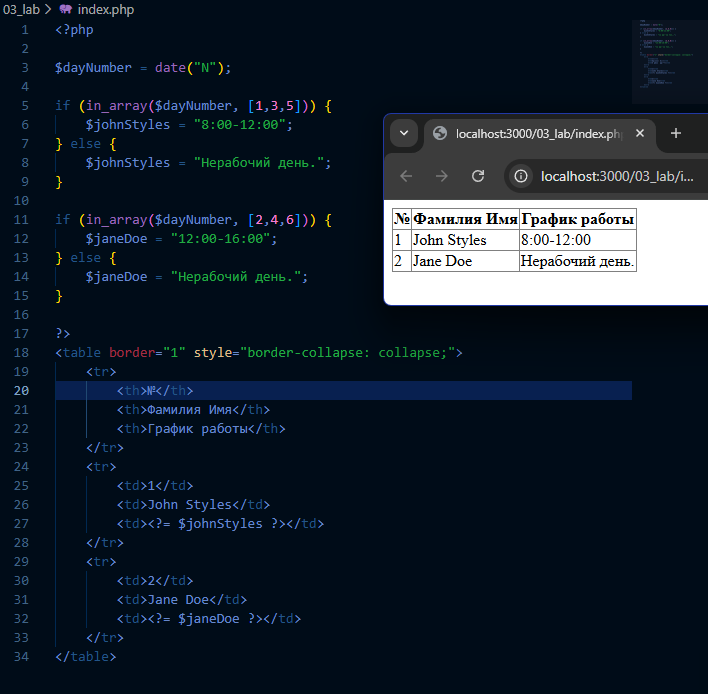
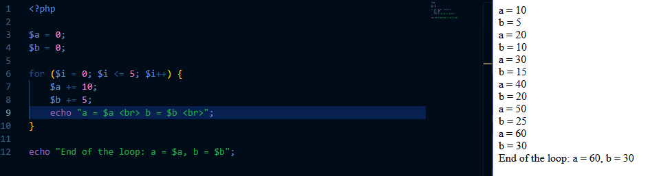
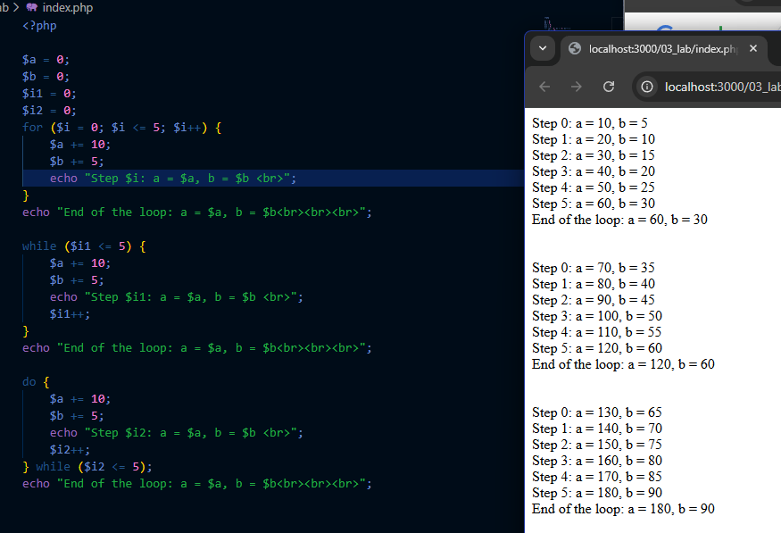

# Лабораторная работа №3. Управляющие конструкции

## Цель работы

Освоить использование условных конструкций и циклов в PHP.

## Условие

### Условные конструкции

1. Используя функцию `date()`, создайте таблицу с расписанием, формируемым на основе текущего дня недели.

| №   | Фамилия Имя | График работы |
| --- | ----------- | ------------- |
| 1   | John Styles | xx - xx       |
| 2   | Jane Doe    | yy - yy       |

- Для `John Styles` (xx - xx):
  - Если текущий день недели — **понедельник, среда или пятница**, выведите график работы **8:00-12:00**.
  - В остальные дни недели выведите текст: **Нерабочий день**.
- Для `Jane Doe` (yy - yy):
  - Если текущий день недели — **вторник, четверг или суббота**, выведите график работы **12:00-16:00**.
  - В остальные дни недели выведите текст: **Нерабочий день**.

### Циклы

1. Создайте файл `index.php` со следующим кодом:

   ```php
   <?php

   $a = 0;
   $b = 0;

   for ($i = 0; $i <= 5; $i++) {
       $a += 10;
       $b += 5;
   }

   echo "End of the loop: a = $a, b = $b";
   ```

2. Добавьте вывод промежуточных значений `$a` и `$b` на каждом шаге цикла.
   
3. Перепишите этот цикл, используя оператор `while` и `do-while`.
   

## Контрольные вопросы

1. В чем разница между циклами `for`, `while` и `do-while`? В каких случаях лучше использовать каждый из них?
   - `for` — когда известно кол-во шагов.
   - `while` — проверка условия *до* выполнения.
   - `do-while` — проверка условия *после* выполнения (минимум 1 проход).
3. Как работает тернарный оператор `? :` в PHP?
   - Короткая запись `if-else`: `условие ? истина : ложь`.
4. Что произойдет, если в `do-while` поставить условие, которое изначально ложно?
   - Цикл выполнится один раз, так как проверка идет в конце.
